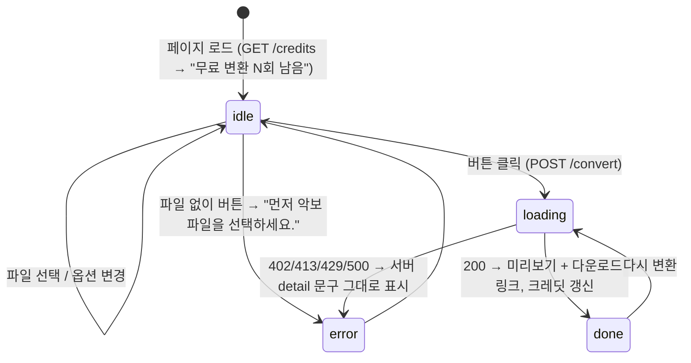

# Notalo 홈페이지 기획문서 (현재 상태 스냅샷)

- 대상 파일: `notalo/static/index.html` (HTML+CSS+JS 단일 파일, 외부 의존 없음)
- 기준 커밋: `8cfda19` (10단계 완료, 배포됨)
- 용도: 디자인 수정 전 "지금 뭐가 있는지" 기록. 수정 요청은 맨 아래 §8에 적는다.

## 1. 한 줄 정의
악보(PDF/JPG/PNG) 올리면 → 음표마다 계이름 붙여서 `[원본]_plus.[ext]`로 돌려주는 단일 페이지.

## 2. 화면 흐름

## 3. 레이아웃 (위→아래, 단일 컬럼, max-width 720px 중앙)

| # | 요소 | 현재 문구 / 값 | id (JS 의존) |
|---|---|---|---|
| 1 | 제목 h1 | `Notalo` | – |
| 2 | 리드 문장 | 악보 PDF·JPG·PNG를 올리면 음표마다 계이름을 적어 돌려줍니다. 파일은 서버에 저장하지 않습니다. | – |
| 3 | 드롭존 (클릭/드래그/키보드) | 굵게: 악보 파일을 여기에 끌어다 놓거나 클릭 / 작게: PDF, JPG, PNG · 20MB까지 | `drop`, `file` |
| 4 | 선택된 파일명 | (선택 후 파일명) | `fname` |
| 5 | 옵션 3개 (데스크톱 3열, ≤640px 1열) | 아래 §4 | `lang`, `position`, `mode` |
| 6 | CTA 버튼 1개 | `계이름 넣기` | `go` |
| 7 | 상태 문구 | 진행/완료/오류 | `s` |
| 8 | 크레딧 문구 | `무료 변환 N회 남음` / `무료 변환을 모두 사용했습니다. 결제 기능은 준비 중입니다.` | `credits` |
| 9 | 결과 영역 (초기 숨김) | 스켈레톤 → `` 미리보기(이미지) 또는 "PDF는 미리보기 대신 파일로 내려받습니다." → 링크 `결과 파일 내려받기` | `result`, `skel`, `img`, `pdfnote`, `dl` |
| 10 | 푸터 | 음표 인식 모델은 DeepScoresV2 데이터셋(Tuggener et al., CC BY 4.0)으로 학습했습니다. / 업로드한 파일과 결과는 처리 직후 삭제됩니다. | – |

## 4. 옵션 (form 필드명 = 서버 파라미터, 바꾸면 app.py도 같이 수정)

| 필드 | 값 | 표시 문구 |
|---|---|---|
| `lang` | `ko` `en` `it` `ja` `de` | 도레미 (한국어) / C D E (영어) / Do Re Mi (이탈리아어) / ドレミ (일본어) / C D E H (독일어) |
| `position` | `below` `above` | 음표 아래 / 음표 위 |
| `mode` | `greedy` `lane` `overlay` | 겹침 피해 배치 / 줄 맞춰 배치 / 음표 위에 덮기 |

## 5. 상태별 문구

| 상태 | 문구 |
|---|---|
| 로딩 | 음표를 읽는 중입니다. 페이지당 10초쯤 걸립니다. (버튼 비활성, 스켈레톤 280px) |
| 완료 | 완료 |
| 파일 미선택 | 먼저 악보 파일을 선택하세요. |
| 402 | 무료 2회를 모두 사용했습니다. 결제 기능은 준비 중입니다. |
| 413 | 파일이 너무 큽니다(20MB 제한). |
| 429 | 너무 많은 요청입니다. 잠시 후 다시 시도하세요. |
| 500 (오선 못 찾음) | 이 악보에서 오선을 찾지 못했습니다. 더 선명한 이미지로 다시 시도해 보세요. |
| 기타 실패 | 처리에 실패했습니다. |

## 6. 디자인 토큰

| 토큰 | 라이트 | 다크 (`prefers-color-scheme`) |
|---|---|---|
| `--bg` | #FAFAF7 | #161615 |
| `--fg` | #1C1C1C | #EDEDE8 |
| `--muted` | #6B6B66 | #9A9A93 |
| `--line` | #D9D9D3 | #3A3A37 |
| `--accent` (버튼·포커스·링크) | #1F4FBF | #6E90E8 |
| `--panel` | #FFFFFF | #1F1F1D |
| `--err` | #B3261E | #F28B82 |

- 폰트: system-ui → Apple SD Gothic Neo → Malgun Gothic → Noto Sans KR. 본문 16px/1.55, h1 28px/700, 라벨 13px, 보조 14px.
- 라운드 8px(입력·버튼·이미지), 10px(드롭존). 여백: 상단 56px, 옵션 위 26px, 결과 위 34px, 푸터 위 64px.
- 결과 악보 라벨 색(서버 렌더): 높은음자리표 빨강 #C8102E, 낮은음자리표 파랑 #1F4FBF, 흰 박스 alpha 230.
- 접근성: 드롭존 `role=button` + Enter/Space, 포커스 링 2px accent, `prefers-reduced-motion`이면 스켈레톤 애니메이션 끔.

## 7. 서버 계약 (디자인 바꿔도 유지)

| 엔드포인트 | 입력 | 출력 |
|---|---|---|
| `GET /credits` | 쿠키 `nt_used` | `{"left": n}` |
| `POST /convert` | multipart `file`, `lang`, `position`, `mode` | 파일 바이너리(`Content-Disposition` = `[원본]_plus.[ext]`), 쿠키 `nt_used` 갱신 |

- 제한: 20MB, IP당 60초 10건, 무료 2회(쿠키, 지우면 리셋).
- 푸터의 DeepScoresV2 출처 문구는 CC BY 4.0 의무 → 삭제 금지, 위치·스타일만 변경 가능.
- `id`와 form `name`은 JS/서버가 참조 → 바꾸려면 같이 수정.

## 8. 디자인 수정 요청 (여기에 적기)

- [ ] 

## 9. 가입/관리 서비스 계정 (내가 아는 것만 — 최신판은 CLAUDE.md)

| 서비스 | 역할(초등학생 설명) |
|---|---|
| GitHub (loveTK/my-first-blog) | 코드를 저장하는 곳. 코드 바뀌면 자동 배포 로봇(Actions)도 여기서 돌아감. |
| AWS Lightsail | 사이트가 실제로 켜져서 돌아가는 서버 컴퓨터. |
| Cloudflare | notalo.xyz 주소를 서버로 연결해주는 곳. |
| Google Analytics | 사이트 방문자 수 세는 도구. |
| Google AdSense | 광고 붙여서 돈 버는 도구. |
| Google OAuth | "구글로 로그인" 버튼의 신분증 확인 열쇠. |
| Gmail (xorud386@gmail.com) | 사용자 문의 받는 이메일. |
| PWA Builder | 웹사이트를 안드로이드 앱 파일로 바꿔주는 도구. |
| Google Play Console | 앱을 스토어에 올리는 곳(예정, 아직 등록 안 함). |
| Zenodo / DeepScoresV2 | AI가 학습한 악보 데이터 출처(계정 아님, 표기 의무). |
